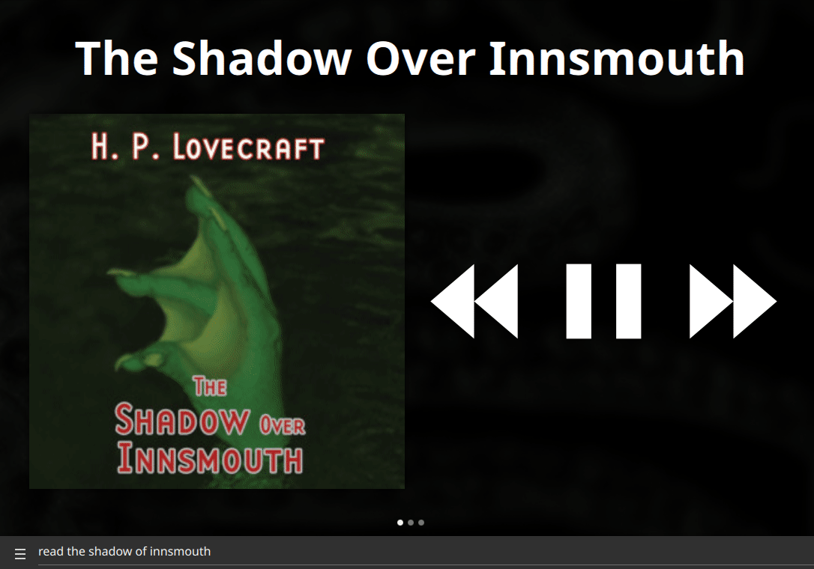

#  Epic Horror Theatre Skill 

Radio drama adaptions of H. P. Lovecraft

## About 

This skill brings to you:

- a radio drama adaptation of H.P. Lovecraft's classic tale, "The Color Out Of Space" directed by Ron N. Butler and published by the Atlanta Radio Theatre Company! Written in March 1927, tonight's tale details the misadventures of a surveyor from Boston who goes to Arkham, Massachusetts to learn the truth behind a shunned place the locals call "the blasted heath"

- a radio drama adaptation of H.P. Lovecraft's classic and titular tale, At The Mountains of Madness! Written in 1931 and finally serialized in 1936, today's horrifying tale follows a team of archaeologists, led by Professor William Dyer from Miskatonic University, as they go to Antarctica and discover secrets about the history of life on Earth that are as mind-boggling as they are terrifying.

- a radio drama adaptation of H.P. Lovecraft's the eponymous tale, "The Shadow Over Innsmouth", written by the legendary O.G. of horror H.P. Lovecraft in late 1931 and once again adapted to audio by the Atlanta Theater Radio Company. In tonight's tale, we follow a youth on his coming-of-age tour through New England, where on his antiquarian adventures, he hears stories of a little town in Massachusetts clouded with rumors of pirate treasure, vicious plagues, and its strange-looking furtive people. The truth, however, is more personal and much more horrifying than our narrator could dare to fear it could possibly be...

## Examples 

* "read the shadow over innsmouth"
* "play mountains of madness book"
* "read the color out of space"
* "read lovecraft"

# Platform support

- :heavy_check_mark: - tested and confirmed working
- :x: - incompatible/non-functional
- :question: - untested
- :construction: - partial support

|     platform    |   status   |  tag  | version | last tested | 
|:---------------:|:----------:|:-----:|:-------:|:-----------:|
|    [Chatterbox](https://hellochatterbox.com)   | :question: |  dev  |         |    never    | 
|     [HolmesV](https://github.com/HelloChatterbox/HolmesV)     | :question: |  dev  |         |    never    | 
|    [LocalHive](https://github.com/JarbasHiveMind/LocalHive)    | :question: |  dev  |         |    never    |  
|  [Mycroft Mark1](https://github.com/MycroftAI/enclosure-mark1)    | :question: |  dev  |         |    never    | 
|  [Mycroft Mark2](https://github.com/MycroftAI/hardware-mycroft-mark-II)    | :question: |  dev  |         |    never    |  
|    [NeonGecko](https://neon.ai)      | :question: |  dev  |         |    never    |   
|       [OVOS](https://github.com/OpenVoiceOS)        | :question: |  dev  |         |    never    |    
|     [Picroft](https://github.com/MycroftAI/enclosure-picroft)       | :question: |  dev  |         |    never    |  
| [Plasma Bigscreen](https://plasma-bigscreen.org/)  | :question: |  dev  |         |    never    |  

- `tag` - link to github release / branch / commit
- `version` - link to release/commit of platform repo where this was tested

## Credits 
- JarbasAl
- [ARTC](https://artc.org/)
- [Epic Horror Theatre](https://www.youtube.com/channel/UCt3yjI_o-5HBwwyuUDNB65w)

## Category
**Entertainment**

## Tags
#audio 
#books
#radio theatre
#lovecraft
#entertainment
